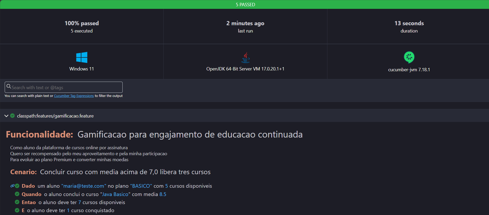
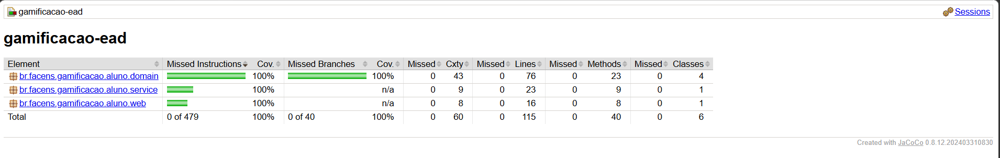
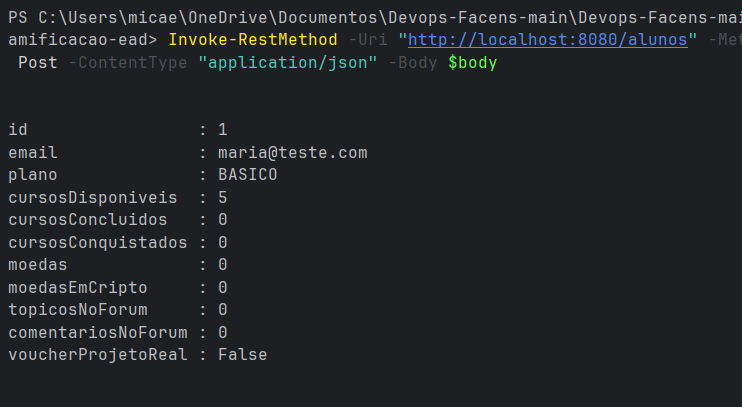
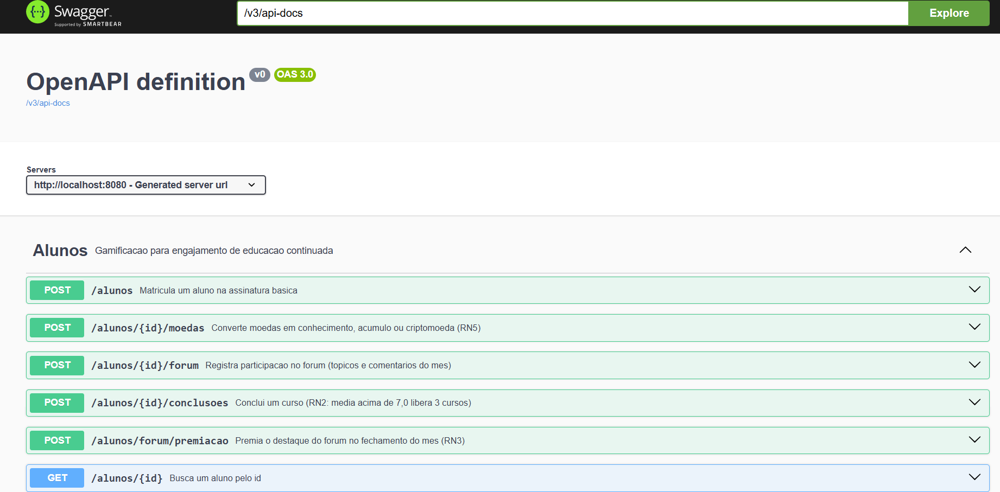
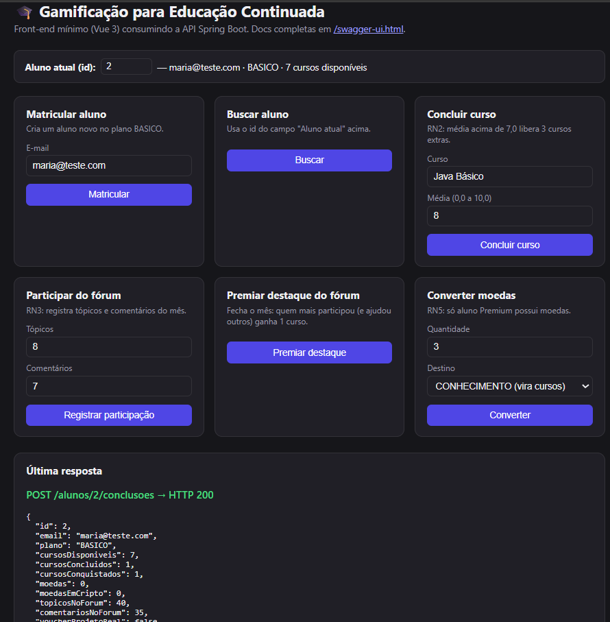

# Evidencias do ATDD

Todos os prints devem ser salvos em `docs/img/` com exatamente estes nomes, para que os
links abaixo funcionem no GitHub.

| # | Evidencia | Arquivo esperado | Como gerar | Status |
|---|---|---|---|---|
| 1 | TDD - RED | `docs/img/01-red.png` | Ver `docs/TDD-RED.md`. Rodar `mvn clean test` antes das classes existirem e printar a falha | ⬜ Pendente |
| 2 | TDD - GREEN | `docs/img/02-green.png` | `mvn clean test` com BUILD SUCCESS | ⬜ Pendente |
| 3 | TDD - BLUE | `docs/img/03-blue.png` | `mvn clean test` de novo, depois das refatoracoes do README | ⬜ Pendente |
| 4 | BDD - Cucumber | `docs/img/04-cucumber.png` | Abrir `target/cucumber-report.html`, printar os 5 cenarios verdes | ✅ Feito |
| 5 | Cobertura Jacoco | `docs/img/05-jacoco.png` | Abrir `target/site/jacoco/index.html`, printar 100% | ✅ Feito |
| 6 | API no ar | `docs/img/06-api.png` | `mvnw spring-boot:run` + chamada (curl ou `Invoke-RestMethod`) do README | ✅ Feito |
| 7 | Swagger | `docs/img/07-swagger.png` | App no ar, abrir `http://localhost:8080/swagger-ui.html` | ✅ Feito |
| 8 | Front-end Vue | `docs/img/08-frontend.png` | App no ar, abrir `http://localhost:8080/`, preencher um formulario e mostrar a resposta | ✅ Feito |
| 9 | PostgreSQL rodando | `docs/img/09-postgres.png` | `docker compose up --build`, abrir PGAdmin (`localhost:5050`, login `admin@facens.br`/`admin`), registrar servidor (host `postgres`, porta `5432`) e mostrar a tabela `aluno` com dados | ⬜ Pendente — precisa de Docker Desktop instalado |
| 10 | H2 rodando | `docs/img/10-h2.png` | App no ar (perfil padrao), abrir `http://localhost:8080/h2-console` (JDBC `jdbc:h2:mem:gamificacao`, usuario `sa`), conectar e mostrar a tabela `aluno` | ⬜ Pendente |
| 11 | Docker Compose | `docs/img/11-docker.png` | `docker compose up --build` com os 3 containers no ar (`app`, `postgres`, `pgadmin`) — printar o log ou `docker ps` | ⬜ Pendente — precisa de Docker Desktop instalado |

> **Nota para quem continuar:** Docker Desktop nao estava instalado na maquina onde os prints 1-8
> foram feitos. Falta instalar o Docker Desktop (https://www.docker.com/products/docker-desktop/)
> pra gerar os prints 9 e 11. O print 10 (H2) nao depende de Docker, pode ser feito a qualquer
> momento com `mvnw spring-boot:run`. Os prints 1-3 (RED/GREEN/BLUE) exigem seguir o roteiro de
> `docs/TDD-RED.md` (o passo RED apaga codigo temporariamente numa branch separada).

## 1 - RED

## 2 - GREEN

## 3 - BLUE

## 4 - Cucumber (BDD)

## 5 - Jacoco 100%

## 6 - API

## 7 - Swagger

## 8 - Front-end (Vue 3)

## 9 - PostgreSQL (via Docker + PGAdmin)

## 10 - H2 Console

## 11 - Docker Compose (app + PostgreSQL + PGAdmin)

